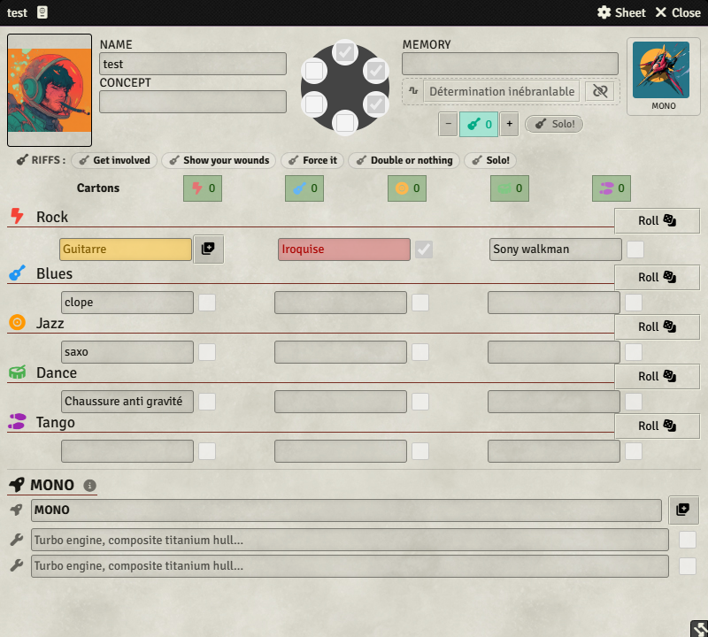
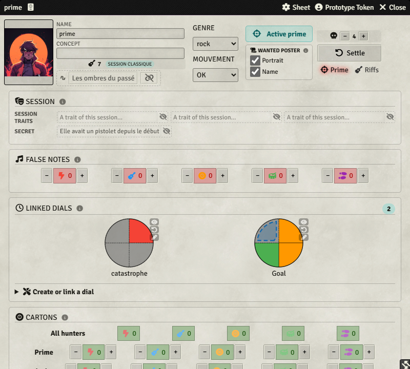
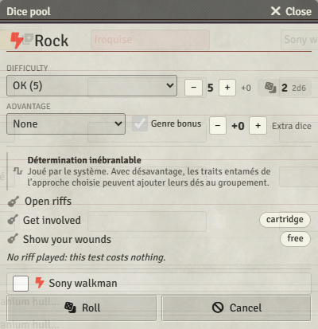
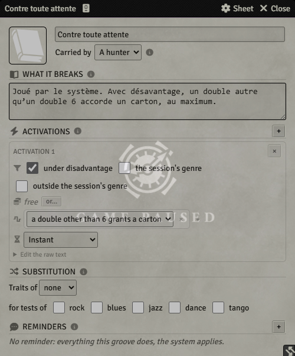

# Cowboy Bebop — système Foundry VTT

[](https://foundryvtt.com/)
[](https://github.com/monnierant/cowboy-bebop/releases/latest)

Un système **Cowboy Bebop** pour Foundry Virtual Tabletop, disponible en français et en anglais. Il accompagne toute la boucle de jeu : fiches des Chasseurs et des Primes, MONO, tests, fausses notes, cartons, riffs, grooves et cadrans liés.

> Projet non officiel, sans affiliation avec les ayants droit de Cowboy Bebop.

## Aperçu

### Chasseurs et MONO

La fiche du Chasseur rassemble les cinq approches, l’état des traits, les cartons, le rythme, les riffs disponibles et le MONO associé.



### Primes et sessions

La fiche de Prime pilote la session : genre, mouvement, secret, traits de session, fausses notes, cartons, risque et cadrans objectifs ou menaces fournis par Sliced Dials.



### Tests et riffs

La boîte de test calcule le groupement, la difficulté et l’avantage, puis présente les riffs disponibles et leur coût. Le résultat reste ensuite sur sa carte de chat, où les corrections et effets peuvent être appliqués.



### Grooves

Les Grooves disposent d’un éditeur complet : public, conditions, paiements alternatifs, effets, durée, substitutions d’approche et rappels.



## Fonctionnalités

- Fiches dédiées aux **Chasseurs**, **Primes**, **MONO** et **vaisseaux mères**.
- Tests persistants dans le chat avec cartons, fausses notes, corrections et relances.
- Riffs configurables par type de session et par mouvement.
- Grooves avec activations, effets persistants et exceptions propres aux règles.
- Gestion des ressources : cartouches, rythme, risque, cartons et fausses notes.
- Compendiums de types de session et de Grooves en **français et en anglais**.
- Cadrans objectifs et menaces intégrés grâce au module **Sliced Dials**.
- Compatibilité Foundry VTT **13 à 14**.

## Installation

Dans Foundry VTT :

1. Ouvrir **Configuration et installation** → **Systèmes de jeu**.
2. Cliquer sur **Installer un système**.
3. Coller l’URL du manifeste :

   ```text
   https://github.com/monnierant/cowboy-bebop/releases/latest/download/system.json
   ```

4. Installer et activer le module requis [Sliced Dials](https://github.com/monnierant/sliced-dials).

La dernière version et ses fichiers sont également disponibles sur la page des [releases](https://github.com/monnierant/cowboy-bebop/releases/latest).

## Développement

Prérequis : Node.js et npm.

```bash
npm install
npm test
npm run build
```

- `npm test` exécute les tests du moteur, des cartes de chat et des compendiums.
- `npm run build` compile TypeScript, les styles, les gabarits et les packs Foundry.

Les décisions d’architecture sont consignées dans [`docs/adr`](docs/adr) et la suite du travail dans [`docs/ROADMAP.md`](docs/ROADMAP.md).
